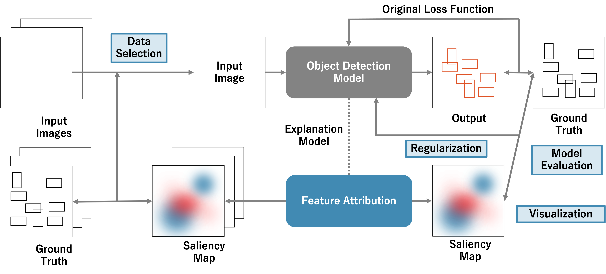
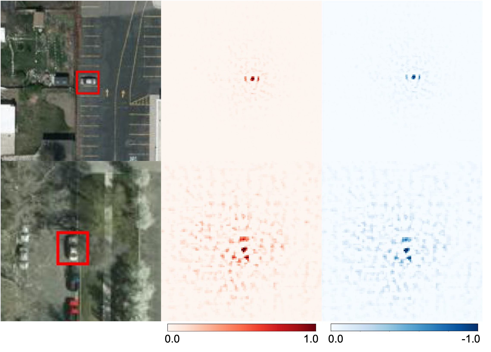

# SHAP-based Methods for Interpretable Object Detection in Satellite Imagery
This is the author implementation of [SHAP-based Methods for Interpretable Object Detection in Satellite Imagery](https://github.com/hiroki-kawauchi/SHAPObjectDetection.git). The implementation of the object detection model (YOLOv3) is based on [Pytorch_YOLOv3](https://github.com/DeNA/PyTorch_YOLOv3). The framework of the proposed method does not depend on any particular object detection model.

<p align="left">

## Performance

#### Visualization
<p align="left">

Please see the paper for details on the results of the evaluation, regularization, and data selection methods.

## Installation
#### Requirements

- Python 3.6.3+
- Numpy
- OpenCV
- Matplotlib
- Pytorch 1.2+
- Cython
- Cuda (verified as operable: v10.2)
- Captum (verified as operable: v0.4.1)

optional:
- tensorboard
- [tensorboardX](https://github.com/lanpa/tensorboardX)
- CuDNN

#### Download the original YOLOv3 weights
download the pretrained file from the author's project page:   

```bash
$ mkdir weights
$ cd weights/
$ bash ../requirements/download_weights.sh
```

## Usage

Please see the test.ipynb


## Paper
### SHAP-based Methods for Interpretable Object Detection in Satellite Imagery
_Hiroki Kawauchi, Takashi Fuse_ <br>

[[Paper]](https://github.com/hiroki-kawauchi/SHAPObjectDetection.git) [[Original Implementation]](https://github.com/hiroki-kawauchi/SHAPObjectDetection.git)


